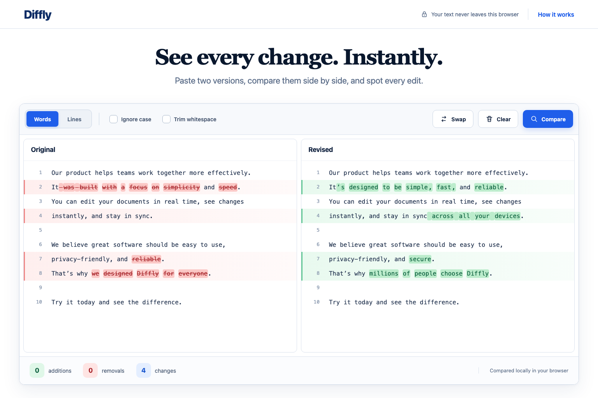

# Diffly

A fast, privacy-first text comparison tool with side-by-side word and line diffs. Diffly runs entirely in the browser—compared text is never uploaded, tracked, or stored.



## Features

- Side-by-side text comparison
- Word-level and line-level diff modes
- Clear highlighting for additions, removals, and changes
- Options to ignore letter case and normalize whitespace
- Swap, clear, and edit controls
- Keyboard shortcuts for faster comparisons
- Responsive desktop and mobile layouts
- No accounts, database, analytics, or server-side processing

## Privacy

All comparison logic runs locally in the browser. Entered text exists only in temporary JavaScript memory and disappears when the page is refreshed or closed.

Diffly does not use:

- A backend API or database
- Cookies or browser storage
- Analytics or tracking scripts
- Third-party text-processing services

## Run locally

Clone the repository and start the included static server:

```bash
git clone <your-repository-url>
cd diffly
npm run dev
```

Open [http://localhost:5000](http://localhost:5000).

No package installation is required. The development command uses Python 3's built-in HTTP server.

> On macOS, AirPlay Receiver may already occupy port 5000. Either disable AirPlay Receiver or run `python3 -m http.server 5001` and open `http://localhost:5001`.

## Test and validate

Run the diff-engine tests:

```bash
npm test
```

Validate the JavaScript source:

```bash
npm run build
```

## Deploy to Vercel

### From GitHub

1. Push this project to a GitHub repository.
2. Import the repository in Vercel.
3. Select **Other** as the framework preset.
4. Deploy. The committed `vercel.json` runs `npm run build` and publishes the generated `public` directory.

### From the command line

```bash
npx vercel
```

Use `npx vercel --prod` when you are ready to publish the production deployment.

## Social link preview

The production build publishes `design/implementation.png` as `/og-image.png` and adds Open Graph and X/Twitter metadata automatically. Vercel's production URL is injected during the build, so sharing the deployed link displays the Diffly interface preview without hardcoding a domain.

## Project structure

```text
diffly/
├── index.html
├── package.json
├── src/
│   ├── app.js
│   ├── styles.css
│   └── lib/
│       ├── diff.js
│       └── diff.test.js
└── design/
    ├── concept.png
    └── implementation.png
```

## Keyboard shortcuts

- `Ctrl/⌘ + Enter` — compare the current texts
- `Esc` — return to editing or close the help dialog
